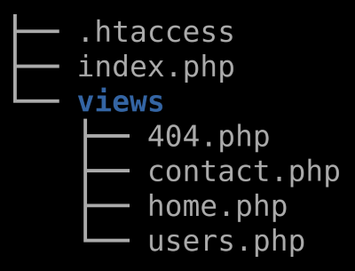

# PHP Routing System with HTMX

This is a simple routing system using PHP as the back-end. 

## Features

- HTTP request types: GET, POST, PUT, DELETE

- Fixed routing via URLs of the form: 
    - `/route`
    - `/route/sub-route`

- Dynamic routing via URLs that include parameter values:
    - `/route/$value`
    - `/route/$value1/$value2`
    - `/route/param/$value`
    - `/route/param1/$value1/param2/$value2`

- Basic templating for page layouts, including HTML partials

- Support for [HTMX](https://htmx.org/) components

## Code

There are two versions of the system here:

- The **dist** folder contains a minimal system for starting a new project.

- The **demo** folder contains the routing system with some demo pages and templates.

